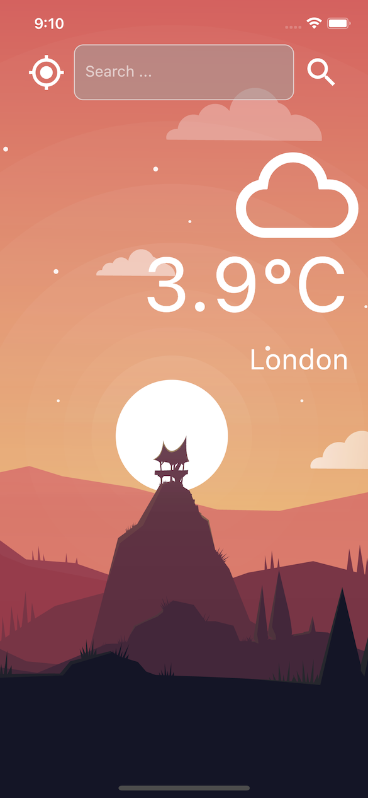

# Weather App

This is a simple Weather App with Flutter using the Delegation Design Pattern
instead of callbacks.



## Prerequisites

This app is using an external provider for fetching weather data, in order to have a working app you 
have to signup to https://openweathermap.org/ and get a personal API_KEY to replace
the placeholder in ```weather_manager.dart```:

```final appId = 'YOUR_APP_ID';```

## Project Structure

The project has multiple folders:

- **classes**: contains the CustomOutlineInputBorder class, which extends the functionalities
of the standard OutlineInputBorder overriding some methods
- **delegates**: contains the WeatherManagerDelegate abstract class with the two main methods to implement => didUpdateWeather() and didFailWithError()
- **models**: contains the model class for the Weather (WeatherModel), and the WeatherManager with all the logic for updating the weather
- **services**: includes the implementation of the library works with the LocationService in order to have a friendly API to use. 
- **screens**: contains the main screen, the app is a one-page application.

You can use this project as reference on how to use the Delegation Design Pattern in Flutter.
If you like it, please give it a star! :)
